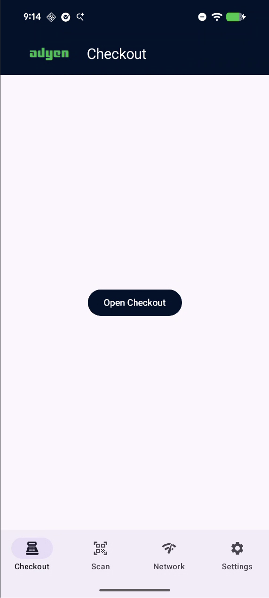
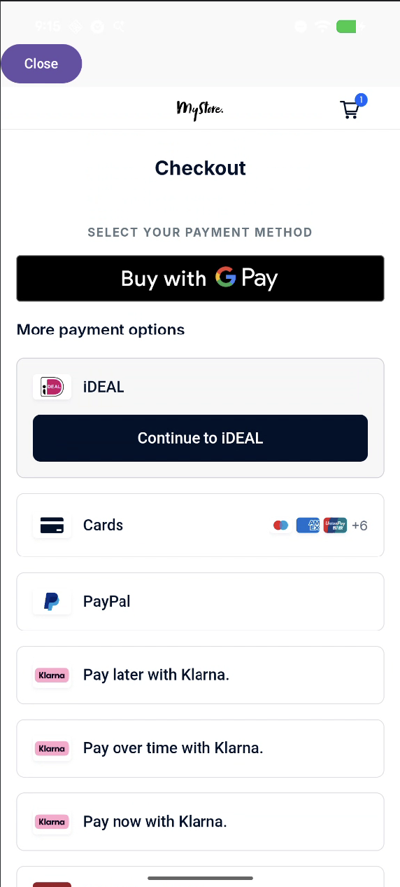
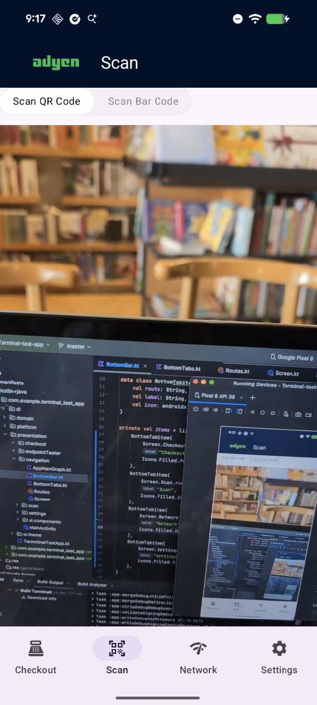
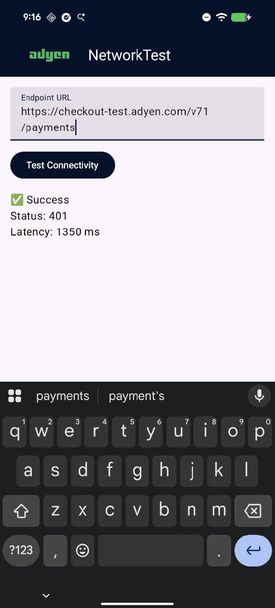

# Adyen Terminal Test App

A simple Android utility app designed to help verify and demonstrate key hardware and software features on Adyen payment terminals.

## Purpose

This app allows partners, developers, and support teams to quickly test and confirm that core terminal capabilities are functioning correctly.

It is especially useful in scenarios where a partner's own app is unable to perform a specific action (e.g., opening a webview, scanning a QR code, or accessing the barcode scanner). Running this test app can prove that the underlying terminal feature works as expected, helping to isolate whether the issue lies in the terminal/hardware or in the partner's implementation.

The app also provides minimal, clean code examples for each feature that can be used as reference when integrating the same functionality into your own app.

 
 

## Features

- **WebView Test**  
  Opens a simple webview to verify that the terminal correctly supports loading web content.

- **Camera QR Code Scanner**  
  Uses the device camera to scan QR codes – demonstrates standard camera access and QR decoding.

- **Terminal API Barcode Scanner**  
  Calls the Adyen Terminal API to access the built-in barcode scanner on supported terminals (bypasses the camera when available).

- **Network Endpoint Tester**  
  Simple tool to send requests to a specified endpoint and view the response. Useful for verifying network connectivity and API reachability from the terminal.

## Usage

1. Install the app on the Adyen terminal (see installation instructions below).
2. Launch the app.
3. Select the feature you want to test from the main menu or bottom navigation.
4. Follow on-screen instructions.

If a feature works in this test app but not in your own app, compare your implementation with the corresponding code in this project.

## Installing the App on an Adyen Terminal

Adyen terminals do not allow sideloading APKs directly. The app must be distributed through the **Adyen Customer Area** (Adyen's secure app store for in-person payments).
